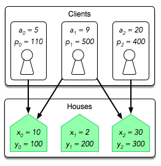

[](https://codecov.io/gh/arturogonzalezm/real_estate_broker_python)
[](https://github.com/arturogonzalezm/real_estate_broker_python/blob/master/LICENSE)
[](https://github.com/arturogonzalezm/docs/real-estate-broker-English.pdf)
[](https://github.com/arturogonzalezm/real_estate_broker_python/actions/workflows/workflow.yml)
[](https://github.com/psf/black)

# Real Estate Broker - HackerRank Challenge

You are a real estate broker in ancient Knossos. 
You have several unsold houses, and each house has an area and a minimum price. 
You also have several clients, and each client wants a house with an area greater than a specified value and at a price less than or equal to a specified maximum.

Each client can buy at most one house, and each house can have at most one owner. The challenge is to determine the maximum number of houses you can sell.

## Input Format

The first line contains two space-separated integers describing the respective values of \(n\) (the number of clients) and \(m\) (the number of houses).

Each line \(i\) of the \(n\) subsequent lines contains two space-separated integers describing the respective values of area \(a_i\) and price \(p_i\) for client \(i\).

Each line \(j\) of the \(m\) subsequent lines contains two space-separated integers describing the respective values of area \(a_j\) and price \(p_j\) for house \(j\).

## Constraints

- \(1 \leq n, m \leq 1000\)
- \(1 \leq a_i, p_i, a_j, p_j \leq 1000\)

## Output Format

Print a single integer denoting the maximum number of houses you can sell.

## Sample Input 0

```
3 3
5 110
9 500
20 400
10 100
2 200
30 300
```

## Sample Output 0

```
2
```


## Explanation

Each client \(i\) is only interested in some house \(j\) where \(a_j > a_i\) and \(p_j \leq p_i\). The diagram below depicts which clients will be interested in which houses:




- Client 1 will be interested in house 1 because it has more than 5 units of space and costs less than 110.
- Client 2 will be interested in houses 1 and 2, as both these houses have more than 9 units of space and cost less than 500.
- Client 3 will be interested in house 3 because it has more than 20 units of space and costs less than 400.

All three clients are interested in the same two houses, so you can sell at most two houses in the following scenarios:

- Client 1 buys house 1 and client 2 buys house 2.
- Client 1 buys house 1 and client 3 buys house 2.
- Client 2 buys house 1 and client 3 buys house 2.

Thus, we print the maximum number of houses you can sell, which is 2, on a new line.
