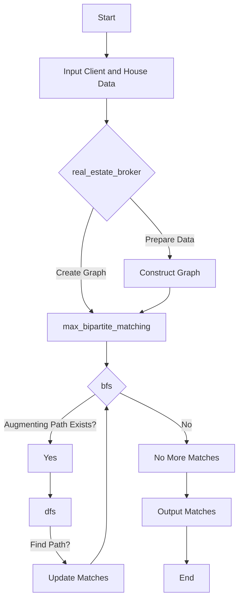

[](https://codecov.io/gh/arturogonzalezm/real_estate_broker_python)
[](https://github.com/arturogonzalezm/real_estate_broker_python/blob/master/LICENSE)
[](https://github.com/arturogonzalezm/real_estate_broker_python/blob/master/docs/real-estate-broker-English.pdf)
[](https://github.com/arturogonzalezm/real_estate_broker_python/actions/workflows/workflow.yml)
[](https://github.com/psf/black)

# Real Estate Broker - HackerRank Challenge

This module provides an implementation for solving the real estate broker problem using a maximum bipartite matching algorithm. It matches clients with houses based on specified requirements, such as required area and maximum price.

## Functions

### `bfs(graph, match, dist, n)`
Performs a Breadth-First Search (BFS) to update distances to the nearest unmatched vertex in a bipartite graph. This function is critical for identifying augmenting paths which can increase the overall matching.

- **Parameters**:
    - `graph (defaultdict)`: The graph representing connections between nodes (clients and houses).
    - `match (dict)`: Current matching status of nodes.
    - `dist (dict)`: Distances to the nearest unmatched node.
    - `n (int)`: Number of nodes in the first partition (clients).

- **Returns**:
    - `bool`: True if an augmenting path is found, otherwise False.

### `dfs(graph, match, dist, v)`
Performs a Depth-First Search (DFS) to find and augment paths in the bipartite graph, improving the matching result.

- **Parameters**:
    - `graph (defaultdict)`: The graph representing connections between nodes.
    - `match (dict)`: Current matching in the bipartite graph.
    - `dist (dict)`: Distance to the nearest unmatched node.
    - `v (int)`: Current node being visited.

- **Returns**:
    - `bool`: True if an augmenting path is found starting from node v, otherwise False.

### `max_bipartite_matching(graph, n)`
Calculates the maximum bipartite matching in the graph, representing the optimal pairing of clients to houses.

- **Parameters**:
    - `graph (defaultdict)`: The graph representing connections between clients and houses.
    - `n (int)`: Number of clients.

- **Returns**:
    - `int`: Maximum number of matched clients to suitable houses.

### `real_estate_broker(clients, houses)`
High-level function that integrates all other functions to solve the real estate broker problem by matching clients to houses based on their requirements.

- **Parameters**:
    - `clients (list)`: List of tuples containing each client's required area and maximum price.
    - `houses (list)`: List of tuples detailing each house's area and price.

- **Returns**:
    - `int`: The maximum number of clients that can be matched to suitable houses.

## Example Usage
The module can be used as follows in a Python script:

```python
from src.real_estate_broker import real_estate_broker
```

## Define clients and houses
clients = [(1200, 300000), (800, 200000)]
houses = [(1000, 250000), (1500, 350000)]

## Compute the matches
matches = real_estate_broker(clients, houses)
print("Number of matches:", matches)

## Solution Diagram



## Sample Input 0

```
3 3
5 110
9 500
20 400
10 100
2 200
30 300
```

## Sample Output 0

```
2
```


## Explanation

Each client \(i\) is only interested in some house \(j\) where \(a_j > a_i\) and \(p_j \leq p_i\). The diagram below depicts which clients will be interested in which houses:


- Client 1 will be interested in house 1 because it has more than 5 units of space and costs less than 110.
- Client 2 will be interested in houses 1 and 2, as both these houses have more than 9 units of space and cost less than 500.
- Client 3 will be interested in house 3 because it has more than 20 units of space and costs less than 400.

All three clients are interested in the same two houses, so you can sell at most two houses in the following scenarios:

- Client 1 buys house 1 and client 2 buys house 2.
- Client 1 buys house 1 and client 3 buys house 2.
- Client 2 buys house 1 and client 3 buys house 2.

Thus, we print the maximum number of houses you can sell, which is 2, on a new line.
